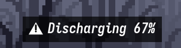

# Inno Notification Agent

Inno is a lightweight, event-driven notification agent for Wayland, written in Rust. It listens for configurable DBus signals and displays non-intrusive, animated notifications.

<p align="center">
  
  
</p>

## Features

- **Wayland native** — Uses wlr-layer-shell for overlay notifications
- **Configurable DBus events** — Listen for any DBus signal, not just battery
- **7 procedural animations** — none, fade, pulse, blink, slide-left, slide-right, bounce
- **Frame animations** — play a directory of PNG frames, decoded lazily and at display size
- **Composable** — a procedural transition can wrap a frame animation
- **Sound with fallback** — probes pw-play, paplay, ffplay, mpv at startup
- **Sound support** — Play audio on notification via paplay (PipeWire/PulseAudio)
- **Hot-reload config** — Edit `inno.toml` and changes apply instantly
- **Click to dismiss** — Click any notification to close it
- **Frame caching** — Efficient rendering with Cairo surface caching
- **Battery aggregation** — Combine multiple battery devices (first, highest, lowest, combined)

## Quick Start

```bash
# Build
cargo build --release

# Run (uses config from ~/.config/inno/inno.toml)
./target/release/inno

# Validate config without running
./target/release/inno --check-config

# Preview one signal, transition and frame animation together
./target/release/inno --test-signal Charging --no-dbus
```

## Installation

### Arch Linux (AUR)

```bash
yay -S inno
# or
paru -S inno
```

### Manual Build

Requirements: `rust`, `cargo`, `wayland`, `cairo`, `dbus`, `pipewire` (for sounds).

```bash
cargo build --release
sudo cp target/release/inno /usr/bin/
```

## Configuration

Inno uses TOML configuration files. Config search order:

1. `./inno.toml` (current directory)
2. `~/.config/inno/inno.toml` (user config)
3. `/etc/xdg/inno/inno.toml` (system config)

Events are loaded from `events/` in the same search paths.

### Config File Format (`inno.toml`)

```toml
[general]
font = "Iosevka NFM"
font_size = 18.0
font_slant = "normal"    # normal, italic, oblique
font_weight = "normal"   # normal, bold
position = "center,bottom,10"
format = "{message} {percent}%"
fps = 60                 # animation frames per second
scale = 1.0              # display scale multiplier

[appearance]
text_color = [1.0, 1.0, 1.0, 1.0]  # RGBA
bg_color = [0.0, 0.0, 0.0, 0.7]
border_radius = 8.0
gradient = true

# output = "primary"       # primary, all, or output name
# battery_mode = "first"   # first, combined, highest, lowest

[colors]
green = [0.0, 1.0, 0.0, 1.0]
red = [1.0, 0.0, 0.0, 1.0]

[[signal]]
message = "Charging"
icon = "󱐋"
icon_size = 28
color = "green"
threshold = 0
state = "charging"
animation = "fade"
duration = 3
sound = "assets/sounds/hardware_insert.wav"
```

### Config Options

| Section | Key | Description |
|---------|-----|-------------|
| `[general]` | `font` | Font family name |
| | `font_size` | Font size in points |
| | `font_slant` | `normal`, `italic`, or `oblique` |
| | `font_weight` | `normal` or `bold` |
| | `position` | Anchor format (see below) |
| | `format` | Text template with `{message}`, `{percent}` |
| | `fps` | Animation frames per second (default 30) |
| | `scale` | Display scale multiplier (default 1.0) |
| `[appearance]` | `text_color` | RGBA array `[R, G, B, A]` (0.0–1.0) |
| | `bg_color` | Background RGBA |
| | `border_radius` | Corner radius in pixels |
| | `gradient` | Enable gradient background |
| `[[signal]]` | `message` | Notification text (supports `{message}` placeholder) |
| | `icon` | Unicode icon character |
| | `icon_size` | Icon size in pixels |
| | `color` | Color name from `[colors]` or RGBA tuple |
| | `threshold` | Battery percentage trigger point |
| | `state` | Battery state: `charging`, `discharging`, `full`, `connected`, `disconnected`, `any` |
| | `animation` | Animation type (see below) |
| | `duration` | Display duration in seconds (`0` = infinite, dismiss by click) |
| | `sound` | Path to sound file (WAV/OGG), resolved relative to config file |

### Position Format

The `position` value uses comma-separated parts:

```
horizontal,vertical,margin_h,margin_v,offset_x,offset_y
```

| Part | Values | Default |
|------|--------|---------|
| `horizontal` | `left`, `center`, `right` | `center` |
| `vertical` | `top`, `center`, `bottom` | `bottom` |
| `margin_h` | pixels | `10` |
| `margin_v` | pixels (defaults to `margin_h`) | `margin_h` |
| `offset_x` | pixels | `0` |
| `offset_y` | pixels | `0` |

Examples:
- `"center,bottom,10"` — centered horizontally, bottom, 10px margin
- `"right,top,20,30"` — top-right, 20px horizontal, 30px vertical margin
- `"center,bottom,0,-50,0,0"` — bottom center with -50px vertical offset

### Animations

| Name | Description |
|------|-------------|
| `none` | Static, no animation |
| `fade` | Fade in → hold → fade out |
| `pulse` | Smooth opacity pulse |
| `blink` | Visible/invisible toggle |
| `slideleft` | Slide in from left, ease out |
| `slideright` | Slide in from right, ease out |
| `bounce` | Parabolic bounce with decay |

### Frame animations

An `[animations]` entry plays a directory of PNG frames. Frames are decoded on
demand and straight to display size, so a 216-frame 640x640 set costs about
0.6 MB resident instead of 337 MB, and loading does not stall the event loop.

```toml
[animations]
cube_charge = { source = "assets/animations/cube_charging", fps = 30, loop = true, display = "text" }
```

| Option | Default | Meaning |
|---|---|---|
| `source` | required | Directory of PNG frames. Relative paths resolve against the config file |
| `fps` | `general.fps` | Playback rate. The frame clock follows this, not `general.fps` |
| `loop` | `true` | Restart at the end instead of finishing |
| `display` | `anim` | `anim` shows the animation alone, `text` puts it above the text |
| `on_complete` | `hold` | `hold` leaves the last frame up, `hide` takes the notification down, `loop` restarts |

Frames are ordered naturally, so `frame_9.png` plays before `frame_10.png`.
An `animation` that names an `[animations]` entry is shorthand for setting
`animation_ref` to it with no transition.

### Composing transitions with content

`animation` is the transition and `animation_ref` is the content, and a signal
may set both:

```toml
animation = "fade"            # fades in and out
animation_ref = "cube_charge"  # content is the cube
```

### Durations

`duration` is optional. Omitted on a signal with a frame animation, the
notification lasts exactly as long as the animation does, derived from the
frame count and rate, so there is nothing to keep in sync by hand. Omitted
with no animation it falls back to 5 seconds. An explicit value always wins,
and `duration = 0` means until dismissed.

### Previewing

`--test-signal <text>` renders the signal whose `message` matches, through the
same path a real DBus event takes, so a transition and a frame animation can be
checked together without producing the event. `--test-frame <name>` previews a
bare asset instead, and `--test-animations` cycles the procedural ones.

`INNO_TRACE=1` logs one line per frame with the elapsed time, frame index, and
transition alpha, which is how playback rate and drift can be measured without a
compositor:

```
INNO_TRACE=1 inno --test-signal Charging 2>&1 | grep TRACE
```

`scripts/render-verify.sh` renders notifications inside a nested Hyprland on its
own socket and reports the bounding box of everything that changed against a
no-daemon baseline. It needs `grim` and `python3` with Pillow. Both matter: a
screenshot of a live desktop contains a wallpaper and a terminal, so "there are
bright pixels in the middle" proves nothing.

### Sounds

Sound files are bundled in `assets/sounds/` (Windows 7 scheme). To use them locally:

```bash
mkdir -p ~/.config/inno/assets/sounds
cp assets/sounds/*.wav ~/.config/inno/assets/sounds/
```

Then reference them in your config with paths relative to the config file:

```toml
sound = "assets/sounds/hardware_insert.wav"
```

Absolute paths also work, so you can point at your own recordings.

The bundled files are 16-bit PCM, which every decoder accepts. At startup the
daemon probes `pw-play`, then `paplay`, then `ffplay`, then `mpv`, playing a
silent sample to check the player, the sound server, and the audio device all
work, and caches whichever succeeds. If none do it warns once and carries on
with notifications silent, since a daemon that will not start over a cosmetic
sound is worse than a quiet one.

`aplay` is deliberately not in the chain: it validates WAV headers strictly and
without a PulseAudio plugin it would bypass the sound server and drive the card
directly.

Turn sound off entirely with `--no-sound` or `sound = false` in `[general]`.

## Custom DBus Events

Inno can listen for **any** DBus signal. Define custom events in `~/.config/inno/events/*.toml`.

### Event Search Paths

1. `./events/` (current directory)
2. `~/.config/inno/events/`
3. `/etc/xdg/inno/events/`

### Event TOML Format

```toml
# ~/.config/inno/events/bluetooth_volume.toml

name = "Bluetooth Volume"
enabled = true
bus = "session"  # or "system"

[match]
interface = "org.freedesktop.DBus.Properties"
member = "PropertiesChanged"
path_prefix = "/org/bluez"
# arg0 = "org.bluez.MediaTransport1"  # optional filter

[extract]
volume = "Volume"

[state_map]
"0" = "muted"
"127" = "max"

[format]
message = "Volume: {volume}"

[conditions]
trigger_on = ["Volume"]  # empty = trigger on any change
debounce_ms = 200
require_all = false      # false = OR logic, true = AND logic
```

### Event Configuration Reference

| Section | Key | Description |
|---------|-----|-------------|
| Root | `name` | Event display name |
| | `enabled` | Enable/disable event |
| | `bus` | DBus type: `system` or `session` |
| `[match]` | `interface` | DBus interface to match |
| | `member` | Signal member name |
| | `path` | Exact object path |
| | `path_prefix` | Object path prefix match |
| | `arg0` | First argument filter |
| `[extract]` | `<name> = "<property>"` | Extract properties into variables |
| `[state_map]` | `"<value>" = "<string>"` | Map numeric values to strings |
| `[format]` | `message` | Format string with `{variable}` placeholders |
| `[conditions]` | `trigger_on` | Properties that trigger notification |
| | `debounce_ms` | Minimum ms between triggers |
| | `require_all` | AND (true) or OR (false) logic |

### Example: Battery Event

```toml
# events/battery.toml
name = "Battery"
bus = "system"

[match]
interface = "org.freedesktop.DBus.Properties"
member = "PropertiesChanged"
path_prefix = "/org/freedesktop/UPower/devices"
arg0 = "org.freedesktop.UPower.Device"

[extract]
percentage = "Percentage"
state = "State"

[state_map]
"1" = "charging"
"2" = "discharging"
"4" = "full"

[format]
message = "{percentage}%"

[conditions]
debounce_ms = 1000
```

## DBus Control Interface

Control Inno externally via the `org.inno.Control` interface on the session bus.

| Method | Signature | Description |
|--------|-----------|-------------|
| `Show` | `(st)` — message, duration | Show a custom notification |
| `Hide` | — | Hide the current notification |
| `GetState` | — | Returns `(percentage, state)` |
| `Reload` | — | Reload configuration |
| `Version` | — | Returns daemon version string |

```bash
# Show notification for 5 seconds
busctl --user call org.inno.Control /org/inno/Control org.inno.Control Show "st" "Hello World" 5

# Hide notification
busctl --user call org.inno.Control /org/inno/Control org.inno.Control Hide

# Get battery state
busctl --user call org.inno.Control /org/inno/Control org.inno.Control GetState

# Reload config
busctl --user call org.inno.Control /org/inno/Control org.inno.Control Reload
```

## CLI Usage

```
inno [OPTIONS]

OPTIONS:
    -h, --help              Show help
    -v, --version           Show version
    -d, --debug             Run in debug mode (logs to terminal)
    --daemon                Run in background (daemon mode)
    -l, --log-file <PATH>   Log output to file (use with --daemon)
    --no-dbus               Disable DBus control interface
    --test <number>         Preview specific animation (1-6)
    --test-animations       Cycle through all animations
    --check-config          Validate config and exit
```

## Directory Structure

```
inno/
├── inno.toml              # Main config (bundled, installed to /etc/xdg/inno/)
├── events/                # Event definitions (*.toml)
│   ├── bluetooth.toml
│   ├── headset_battery.toml
│   └── laptop_battery.toml
├── assets/
│   ├── images/            # Screenshots
│   └── sounds/            # Windows 7 notification sounds (*.wav)
├── inno.service           # Systemd user service
├── PKGBUILD               # Arch Linux AUR package
└── src/                   # Rust source code
```

## License

MIT
